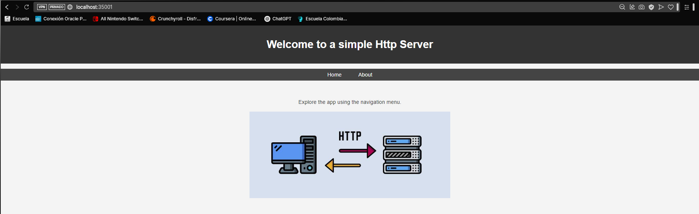

# AREP-Lab4
# Workshop on modularization with virtualization and Introduction to Docker

## Overview

This project involves the development of a lightweight web server in Java that supports serving static HTML and PNG files. Additionally, it implements an IoC (Inversion of Control) framework to build web applications from POJOs. The server processes multiple non-concurrent requests and dynamically loads annotated components to expose RESTful endpoints.

## Getting Started

These instructions will guide you through obtaining a copy of the project running on your local machine for development and testing purposes
### Prerequisites

To run this project, you must have Java installed on your system. Follow the steps below to install Java and Maven (which is used for managing dependencies).
1. **Install Java:**

    Download and install the Java JDK (version 11 or higher). You can follow the instructions on the [official Java website](https://www.oracle.com/java/technologies/javase-jdk11-downloads.html).

2. **Install Maven:**

   - Maven is used to manage project dependencies. You can download and install Maven from [here](https://maven.apache.org/download.cgi).

   - After installation, verify if Maven is correctly installed by running: mvn -v. This should show the installed Maven version.
3. **Install Docker**  
### Installing
> [!NOTE]
> You should perform the following steps from a Bash terminal or PowerShell on Windows. And previously start DockerDeskopt

o set up your development environment:
1. **Clone the repository:**
```bash
   git clone https://github.com/CristianAlvarez-b/AREP-Lab4
```
2. **Navigate to the project directory:**
```bash
   cd AREP-Lab4
```
3. **Build the project with Maven:**
```bash
   mvn clean install
```
  This will compile the code and package it into an executable JAR file.
4. **Create the image:**
```bash
   docker build --tag dockereciboot .
```
5. **Create the docker instance:**
```bash
    docker run -d -p 35000:6000 --name firstdockercontainer dockereciboot
```
The application in this case will run on port 35000.

## Features

### Multi-Threaded HTTP Server
- Handles multiple clients simultaneously using threads.
- Supports concurrent requests without blocking the main execution.

### Graceful Shutdown with Shutdown Hook
- Implements a **runtime shutdown hook** to stop the server cleanly.
- Ensures proper resource release and safely closes the `ServerSocket`.

### Dynamic Routing Support
- Allows defining custom routes.
- Processes dynamic requests via `EciBoot`.

### Static File Server
- Serves HTML, CSS, JS, images, and more from a configurable directory (`staticFilesLocation`).
- Supports multiple content types (`text/html`, `application/javascript`, `image/png`, etc.).

###  AWS EC2 Deployment
- Configured for deployment on **EC2 instances**.
- **Security group rules** enabled to allow access through port `35000`.

### Improved Connection Handling
- **Enhanced exception handling** to prevent unexpected crashes.
- Ensures safe closure of `clientSocket` after each request.
### Project Structure
```Bash
AREP-Lab4/
│── src/
│   ├── main/
│   │   ├── java/
│   │   │   ├── co/edu/eci/arep/appsvr/
│   │   │   │   ├── EciBoot.java
│   │   │   │   ├── GetMapping.java
│   │   │   │   ├── RequestParam.java
│   │   │   │   ├── RestController.java
│   │   │   ├── co/edu/eci/arep/serverHttp/
│   │   │   │   ├── HttpServer.java
│   │   │   ├── co/edu/eci/arep/example/
│   │   │   │   ├── GreetingController.java
│   ├── resources/
│   │   ├── webroot/public/
│   │   │   │── css/
│   │   │   │── js/
│   │   │   │── img/
│   │   │   ├── index.html
│── pom.xml
│── README.md
```
## Implementation Details

## Concurrency
To implement concurrency, each incoming request spawns a new thread responsible for handling the request. This ensures that multiple requests can be processed simultaneously without blocking the main server loop.

Additionally, to ensure a graceful shutdown, a shutdown hook is registered. This hook listens for termination signals (such as CTRL + C or system shutdown events) and ensures that the server stops accepting new connections while closing active resources properly. This prevents abrupt disconnections and potential resource leaks.

In the implementation below, when a client connection is accepted, a new thread is created to handle it asynchronously. The shutdown hook guarantees that the server shuts down cleanly when terminated:
```Java
public static void start(String[] args) throws IOException {
        int port = getPort();
        serverSocket = new ServerSocket(port);
        EciBoot.loadComponents();
        System.out.println("Servidor iniciado en el puerto " + port + "...");

        // Hook de apagado elegante
        Runtime.getRuntime().addShutdownHook(new Thread(() -> {
            try {
                System.out.println("Apagando servidor...");
                running = false;
                if (serverSocket != null && !serverSocket.isClosed()) {
                    serverSocket.close();
                }
                System.out.println("Servidor apagado correctamente.");
            } catch (IOException e) {
                e.printStackTrace();
            }
        }));

        while (running) {
            try {
                Socket clientSocket = serverSocket.accept();
                new Thread(() -> handleClient(clientSocket)).start();
            } catch (IOException e) {
                if (!running) {
                    System.out.println("Servidor detenido.");
                } else {
                    e.printStackTrace();
                }
            }
        }
    }
```
### Concurrency Testing
- To evaluate the performance and concurrency of the HTTP server, Apache JMeter was used, an open-source tool designed for load and stress testing. A Thread Group was configured with 50 threads (concurrent users), simulating simultaneous requests to the server. Key metrics such as response time, throughput, and error percentage were defined to analyze the server's ability to handle multiple connections efficiently. The results obtained from Listeners like View Results Tree and Summary Report provided detailed insights into the server’s behavior under load, ensuring that the thread-based implementation functions correctly.


## Docker
- Configure the Dockerfile:
```CMD
FROM openjdk:17

WORKDIR /usrapp/bin

ENV PORT 6000

COPY /target/classes /usrapp/bin/classes
COPY /target/dependency /usrapp/bin/dependency

CMD ["java","-cp","./classes:./dependency/*","co.edu.eci.arep.serverHttp.WebApplication"]
```
- We create the image


- We create instances for the container

- We verify the creation of the instances

- We tested in the browser



- Upload to docker hub


## AWS
1. Access the virtual machine


2. Install Docker


3. Start the docker service


4. Set your user in the docker group so you don't have to enter “sudo” every time you invoke a command


5. From the image created in Dockerhub create an instance of a docker container independent of the console (“-d” option) and with port 6000 bound to a physical port on your machine (-p option):


6. Open the virtual maximum security group inbound ports to access the service


7. Check service


### Running the Tests
Automated tests are included to ensure the server and web application functionality.
> [!NOTE]
> You should test in a diferent Bash terminal or PowerShell on Windows.
1. **Ejecutar pruebas unitarias:**
   Run unit tests: To run the automated tests, use the following Maven command:
   ```bash
   mvn test
   ```
   This will run all the unit tests and show the results in the terminal.

## Test
### Unit Test


### Funcional Test

The following video shows the aws deployment:


https://github.com/user-attachments/assets/08bb3e75-8df3-4ab8-9b93-9e3c79ab28b7


### Built with
- Java: The programming language used
- Maven: Dependency management and build tool
- JUnit: Testing framework
- Mockito: Mocking framework for unit testing
- Docker: Container

### Author
- Cristian Javier Alvarez Baquero
  
### License
This project is licensed under the MIT license: see the LICENSE.md file for details.

### Explanation of Sections:
- **Getting Started**: Instructions for setting up the development environment.
- **Prerequisites**: What tools you need and how to install them (Java and Maven).
- **Installing**: How to clone the repository, build, and run the project.
- **Running the Tests**: How to run the tests and what types of tests are included (unit and functional).
- **Built with**: Tools and libraries used in the project.
- **License**: License type (MIT) and link to the license file.


This project is licensed under the MIT license: see the LICENSE.md file for details.


